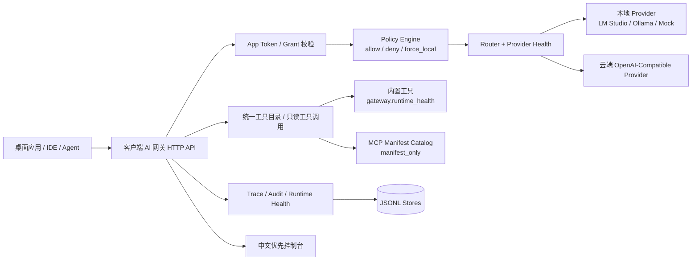
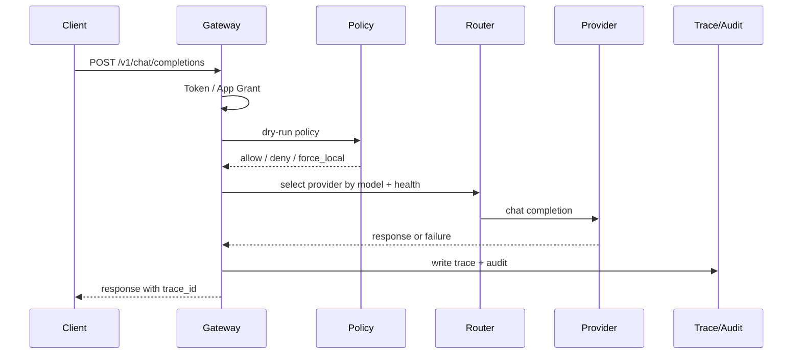
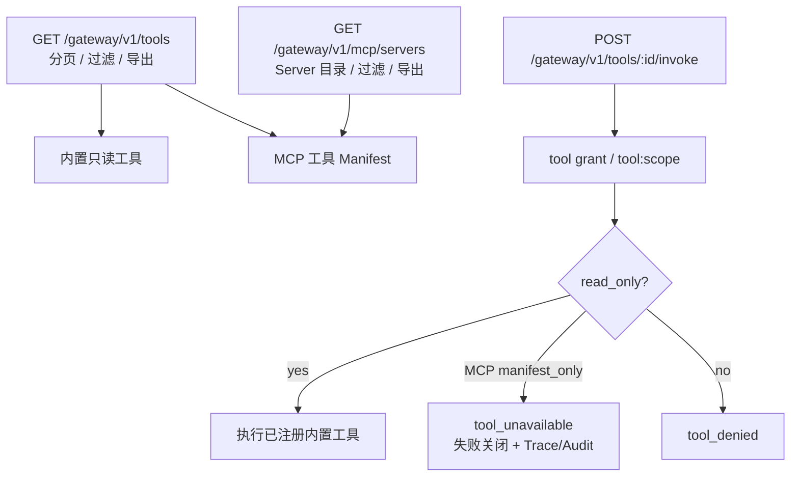

# 客户端 AI 网关

这是一个面向 AI PC、本地开发环境、企业桌面 AI 能力底座的客户端 AI 网关原型。当前实现提供 OpenAI 兼容聊天入口、Provider 路由与健康管理、策略试算、Trace/Audit 可观测能力、只读工具调用、中文优先的本地控制台。

## 快速链接

- 本地控制台：<http://127.0.0.1:18765/console>
- 开发配置：[configs/dev.json](configs/dev.json)
- 错误码：[docs/error-codes.md](docs/error-codes.md)
- 企业部署形态：[docs/enterprise-deployment.md](docs/enterprise-deployment.md)
- 权限与审计模型：[docs/permission-audit-model.md](docs/permission-audit-model.md)
- 失败降级机制：[docs/failure-degradation.md](docs/failure-degradation.md)
- 企业集中审计：[docs/enterprise-audit-siem.md](docs/enterprise-audit-siem.md)
- 安全审查清单：[docs/security-checklist.md](docs/security-checklist.md)
- 产品化路线图：[docs/roadmap.md](docs/roadmap.md)
- Provider SDK 边界：[docs/provider-sdk.md](docs/provider-sdk.md)
- Tool / Plugin SDK 边界：[docs/tool-plugin-sdk.md](docs/tool-plugin-sdk.md)
- MCP 真实运行时设计：[docs/mcp-runtime-design.md](docs/mcp-runtime-design.md)
- 入口程序：[cmd/gateway-daemon](cmd/gateway-daemon)
- 核心流水线：[internal/core](internal/core)
- HTTP 接入层：[internal/access](internal/access)
- Provider 适配器：[internal/adapters](internal/adapters)
- 工具注册表：[internal/tools](internal/tools)

## 当前能力

- OpenAI 兼容接口：`POST /v1/chat/completions`
- 本地控制台：`GET /console`
- Trace 查询、详情、导出和保留策略
- Audit 查询、分页、导出、按 `trace_id` 关联
- Provider 健康监控、启停、探测、模型目录
- Runtime Health 状态接口
- Policy dry-run 和 Routing explain
- Access dry-run 权限试算
- OpenAI-compatible Provider 适配器
- 只读工具运行时 MVP
- 工具调用 Trace 化、Audit 关联、权限 scope 校验
- 中文优先、中英文切换控制台

## 总体架构



## 请求链路



## 工具与 MCP 治理



## 启动

```powershell
go run ./cmd/gateway-daemon -config ./configs/dev.json
```

默认监听：

```text
127.0.0.1:18765
```

健康检查：

```powershell
curl http://127.0.0.1:18765/healthz
```

控制台地址：

```text
http://127.0.0.1:18765/console
```

真实浏览器 UI smoke：

```powershell
powershell -ExecutionPolicy Bypass -File scripts/ui-smoke.ps1
```

脚本会使用本机 Edge/Chrome headless 打开控制台，并生成桌面和窄屏截图到 `artifacts/ui-smoke/`。

## 快速聊天请求

```powershell
curl -X POST http://127.0.0.1:18765/v1/chat/completions `
  -H "Authorization: Bearer dev-token" `
  -H "Content-Type: application/json" `
  -d "{\"model\":\"local-small\",\"messages\":[{\"role\":\"user\",\"content\":\"你好\"}]}"
```

响应会包含 `trace_id`，可用于排障和审计关联。

## Trace

```powershell
curl http://127.0.0.1:18765/gateway/v1/traces
curl "http://127.0.0.1:18765/gateway/v1/traces?limit=20&offset=0&status=completed"
curl http://127.0.0.1:18765/gateway/v1/traces/{trace_id}
curl "http://127.0.0.1:18765/gateway/v1/traces/export?limit=500&status=failed" -o traces.jsonl
```

Trace 列表返回 `traces`、`total`、`offset`、`limit`。支持按 `status`、`app_id`、`provider_id` 过滤。控制台的 Trace 列表筛选和导出会复用同一组条件。

默认 Trace 存储为 `data/traces.jsonl`。可通过配置项 `trace_retention_max` 控制最多保留条数；`0` 或不配置表示不裁剪。

Trace 详情会保存一份用于复盘的请求快照，包含 `model`、`messages`、`metadata` 和 `data_labels`，但不会保存应用 Token。快照安全策略由配置控制：

- `trace_snapshot_enabled`：是否保存请求快照，默认开启。
- `trace_redact_labels`：命中任一数据标签时脱敏消息内容和 metadata 值，默认 `["sensitive"]`。
- `trace_snapshot_max_chars`：单个消息内容或 metadata 值的最大保留字符数，`0` 表示不截断。

脱敏后会保留结构、角色、metadata key 和数据标签，值写为 `[redacted]`；截断后追加 `...[truncated]`，Trace 详情和导出都会复用这份安全快照。

Trace 导出只导出 Trace Store 中已经保存的记录，不重新读取原始请求；请求快照会保持已脱敏或已截断状态，导出文件不包含应用 Token。

## Audit

```powershell
curl "http://127.0.0.1:18765/gateway/v1/audit/events?limit=20&offset=0" `
  -H "Authorization: Bearer admin-token"

curl "http://127.0.0.1:18765/gateway/v1/audit/events?trace_id={trace_id}" `
  -H "Authorization: Bearer admin-token"

curl "http://127.0.0.1:18765/gateway/v1/audit/events/export?limit=500&action=tool.invoke" `
  -H "Authorization: Bearer admin-token" `
  -o audit-events.jsonl
```

Audit 支持 `action`、`result`、`app_id`、`trace_id`、`limit`、`offset` 查询。控制台可按动作、结果、应用和 Trace ID 筛选，导出会带上当前筛选条件；点击审计行可查看完整事件 JSON，并在存在 `trace_id` 时联动打开 Trace 详情。默认持久化到 `data/audit.jsonl`，可通过 `audit_store_path` 调整路径，通过 `audit_retention_max` 控制保留条数。

工具调用和权限试算的 Audit `metadata` 会包含 `required_scopes`、`matched_grant`、`missing_grants`、`sandbox_required`、`origin` 等字段，用于解释为什么允许或拒绝。

Audit 导出需要管理员授权，导出内容复用当前筛选条件；当审计事件通过 `trace_id` 关联请求复盘时，请求内容仍以 Trace 安全快照为准。

## Provider 与模型目录

```powershell
curl http://127.0.0.1:18765/gateway/v1/providers
curl http://127.0.0.1:18765/gateway/v1/models
curl "http://127.0.0.1:18765/gateway/v1/providers/export?class=local" -o providers.jsonl
curl "http://127.0.0.1:18765/gateway/v1/models/export?provider_class=local" -o models.jsonl
curl http://127.0.0.1:18765/gateway/v1/runtime/health
```

Provider 列表包含静态配置和运行时健康字段：`runtime_status`、`degraded_reason`、`last_checked_at`。当前状态包括：

- `healthy`
- `degraded`
- `unhealthy`
- `disabled`

模型目录会聚合 Provider 中声明的模型，并返回 Provider 元信息和可用性。使用 `?all=true` 可查看不可用模型。

## Provider 管理

```powershell
curl -X POST http://127.0.0.1:18765/gateway/v1/providers/local-mock/enabled `
  -H "Authorization: Bearer admin-token" `
  -H "Content-Type: application/json" `
  -d "{\"enabled\":false}"

curl -X POST http://127.0.0.1:18765/gateway/v1/providers/local-mock/probe `
  -H "Authorization: Bearer admin-token"
```

Provider 启停会写回配置文件并重新加载运行时快照。Provider 探测只更新运行时健康状态。

## 配置重载

```powershell
curl -X POST http://127.0.0.1:18765/gateway/v1/config/reload `
  -H "Authorization: Bearer admin-token"
```

配置重载会重新读取配置文件，重建 Provider adapter、Policy engine、Router、Pipeline 和 Provider health monitor，然后原子替换运行时快照。重载需要 `admin` grant。

## 策略试算与路由解释

Policy dry-run：

```powershell
curl -X POST http://127.0.0.1:18765/gateway/v1/policy/dry-run `
  -H "Content-Type: application/json" `
  -d "{\"app_id\":\"dev-app\",\"request_type\":\"chat\",\"data_labels\":[\"sensitive\"],\"model\":\"local-small\"}"
```

Routing explain：

```powershell
curl -X POST http://127.0.0.1:18765/gateway/v1/routing/explain `
  -H "Content-Type: application/json" `
  -d "{\"app_id\":\"dev-app\",\"request_type\":\"chat\",\"model\":\"local-small\",\"data_labels\":[\"sensitive\"]}"
```

策略规则支持轻量匹配 DSL。空匹配字段表示匹配全部。支持字段：

- `priority`：可选，数字越大越先评估；同优先级保持配置顺序。
- `app_ids`
- `request_types`
- `models`
- `provider_classes`
- `data_labels`

Policy 目录和 dry-run 会返回 `condition_summary`，用于把散落的匹配字段汇总成可读条件；命中规则的 `priority`、`condition_summary` 也会进入 `explain_chain` 和 Audit metadata。

Policy 目录按实际评估顺序返回，并提供 `evaluation_order`，便于控制台列表、导出文件和 dry-run 诊断保持同一套规则顺序。

Policy 目录的 `data_label` 过滤使用有效标签；未显式配置 `data_labels` 的 `deny_cloud_for_sensitive` 兼容规则会按 `sensitive` 标签展示和过滤。

Policy 目录还会返回 `effect_semantics`，结构化说明该效果是否允许请求、是否允许云端 Provider、是否强制本地以及可读描述。

查看单条策略详情：

```powershell
curl http://127.0.0.1:18765/gateway/v1/policies/deny-sensitive-cloud `
  -H "Authorization: Bearer admin-token"
```

支持效果：

- `allow`：允许请求，可走本地或云端。
- `deny`：路由前拒绝请求。
- `force_local`：允许请求，但禁止云端 Provider。
- `deny_cloud_for_sensitive`：敏感数据禁止云端降级的兼容效果。

示例：

```json
{
  "id": "desktop-local-only",
  "priority": 80,
  "effect": "force_local",
  "reason": "桌面 AI 请求优先留在本地运行时",
  "app_ids": ["desktop-app"],
  "request_types": ["chat"],
  "models": ["local-large"],
  "provider_classes": ["cloud"]
}
```

## 权限试算

Access dry-run 用于在不真实调用模型或工具的情况下，检查某个应用是否具备指定动作权限。

```powershell
curl -X POST http://127.0.0.1:18765/gateway/v1/access/dry-run `
  -H "Content-Type: application/json" `
  -d "{\"app_id\":\"dev-app\",\"action\":\"tool.invoke\",\"tool_id\":\"gateway.runtime_health\"}"
```

支持动作：

- `chat`：要求 `chat` grant。
- `admin`：要求 `admin` grant。
- `tool.invoke`：要求 `tool` 宽权限，或工具 manifest 中所有 scope 对应的 `tool:<scope>` 细粒度权限。

响应会说明 `allowed`、`reason`、`matched_grant`、`missing_grants`，工具试算还会返回工具来源、scope、只读状态和 sandbox 要求。控制台提供“权限试算”面板，并会把试算事件写入 Audit，Audit metadata 同步记录试算结论和缺失权限。

Policy dry-run、Routing explain 和 Access dry-run 都会返回 `explain_chain`，并把同名字段写入 Audit metadata。该字段统一描述当前阶段、决策、原因、命中的策略规则或授权、缺失授权和建议下一步，便于从控制台审计详情或导出文件中串联“为什么允许 / 为什么拒绝 / 下一步该处理什么”。

Policy dry-run 和 Routing explain 还会在 `decision.rule_evaluations` / `policy.rule_evaluations` / Audit metadata 中返回规则评估诊断，按实际优先级顺序列出已检查规则、是否命中、未匹配字段和 `condition_summary`，用于解释“为什么不是上一条规则命中”。

## 工具调用

查看工具：

```powershell
curl http://127.0.0.1:18765/gateway/v1/tools
```

工具列表支持分页与过滤：

- `limit` / `offset`
- `tool_id`：只看指定工具
- `origin`：`builtin` 或 `mcp`
- `server_id`：只看指定 MCP server 下的工具
- `scope`：只看包含指定 scope 的工具
- `enabled`：`true` 或 `false`

导出工具列表：

```powershell
curl "http://127.0.0.1:18765/gateway/v1/tools/export?origin=mcp&scope=desktop.read" `
  -o tools.jsonl
```

调用内置只读工具：

```powershell
curl -X POST http://127.0.0.1:18765/gateway/v1/tools/gateway.runtime_health/invoke `
  -H "Authorization: Bearer dev-token" `
  -H "Content-Type: application/json" `
  -d "{}"
```

当前 Phase 2 只开放只读工具。内置 `gateway.runtime_health` 会通过工具调用链路返回运行时健康快照。

工具调用要求应用具备：

- 宽权限：`tool`
- 或细粒度权限：例如 `tool:runtime.read`

工具响应包含：

- `trace_id`
- `app_id`
- `duration_ms`
- `output`

每次工具调用都会写入 Trace，并产生同一个 `trace_id` 关联的 `tool.invoke` Audit 事件。

## 工具 Manifest

当前工具配置字段：

- `id`
- `name`
- `adapter`
- `description`
- `read_only`
- `risk_level`
- `scopes`
- `input_schema`
- `output_schema`
- `sandbox_required`
- `enabled`

当前 MVP 约束：

- `read_only` 必须为 `true`
- `scopes` 不能为空
- `risk_level` 支持 `low`、`medium`、`high`
- `sandbox_required` 暂时必须为 `false`

## 新增只读工具

工具扩展走 `internal/tools` 包的稳定契约：

```go
type Tool interface {
    ID() string
    Manifest() tools.Manifest
    Invoke(context.Context, tools.Input) (tools.Result, error)
}
```

新增一个只读工具的步骤：

1. 在 `internal/tools` 中实现 `Tool` 接口。
2. 在 `NewRegistryFromConfig` 中按 adapter 名称注册工具。
3. 在 `configs/dev.json` 的 `tools` 数组中增加工具 manifest。
4. 为调用方 app 添加 `tool:<scope>` 或 broad `tool` grant。
5. 增加 registry contract test 和 access HTTP test。

工具错误应返回 `tools.Error`，并带稳定 `Code`。当前内置错误码：

- `tool_unavailable`
- `tool_failed`

Access 层会把工具错误码映射成 HTTP 错误响应、Trace 和 Audit 事件；新增只读工具通常不需要修改 access 层。

## MCP 运行时占位

当前版本支持在配置中声明 MCP server 和只读工具 manifest，用于提前打通企业桌面工具目录、权限 scope、风险等级和运行时健康展示。

重要边界：

- 只加载 manifest，不启动 MCP server。
- 不执行外部命令、不读取 command 字段。
- MCP 工具会出现在 `GET /gateway/v1/tools`，`origin` 为 `mcp`，`adapter` 为 `mcp-placeholder`。
- MCP 工具目前不会注册为可执行适配器，调用会返回稳定错误码 `tool_unavailable` 并写入 Trace/Audit。
- 所有 MCP 工具必须 `read_only=true`，且 `sandbox_required=false`。
- `mcp_runtime.mode` 当前只支持 `manifest_only` 或 `disabled`；`stdio`、`direct`、`sandboxed` 等真实执行模式会在配置加载时被拒绝。

查看 MCP 目录：

```powershell
curl http://127.0.0.1:18765/gateway/v1/mcp/servers
```

导出 MCP 目录：

```powershell
curl "http://127.0.0.1:18765/gateway/v1/mcp/servers/export?scope=desktop.read" `
  -o mcp-servers.jsonl
```

支持查询参数：

- `server_id`：只看指定 MCP server
- `scope`：只看包含指定 scope 的工具
- `enabled`：`true` 只看启用工具，`false` 只看禁用工具
- `limit` / `offset`：分页查看 MCP server 目录

响应包含：

- `enabled`
- `mode`
- `total`
- `offset`
- `limit`
- `servers[].enabled`
- `servers[].tool_count`
- `servers[].enabled_tools`
- `servers[].tools[]`

配置示例：

```json
{
  "mcp_runtime": {
    "enabled": true,
    "mode": "manifest_only",
    "servers": [
      {
        "id": "desktop-context",
        "name": "Desktop Context MCP Placeholder",
        "enabled": true,
        "tools": [
          {
            "id": "mcp.desktop.list_context",
            "name": "Desktop Context List",
            "read_only": true,
            "risk_level": "low",
            "scopes": ["desktop.read"],
            "sandbox_required": false,
            "enabled": true
          }
        ]
      }
    ]
  }
}
```

运行时健康接口会返回 `mcp_runtime.status`、`mode`、server/tool 总数和启用数量。后续接入真实 MCP 适配器前，需要先补沙箱进程模型、授权弹窗、审计字段和 Provider SDK 边界。

## OpenAI-Compatible Provider

Provider 在 `configs/dev.json` 中注册。未配置 `adapter` 时默认使用内置 `mock` adapter。

OpenAI-compatible Provider 使用标准 `/v1/chat/completions` 上游路径。

示例：

```json
{
  "id": "local-openai",
  "name": "Local OpenAI Compatible",
  "class": "local",
  "adapter": "openai-compatible",
  "base_url": "http://127.0.0.1:1234",
  "api_key_env": "LOCAL_OPENAI_API_KEY",
  "models": ["local-small"],
  "healthy": true,
  "enabled": true
}
```

如果设置了 `api_key_env`，网关会从对应环境变量读取 API Key。环境变量缺失或为空时，daemon 仍可启动，但 Provider health 会报告 `missing_credential`，并通过正常健康监控进入 degraded/unhealthy。

LM Studio 示例：

```json
{
  "id": "lm-studio",
  "name": "LM Studio",
  "class": "local",
  "adapter": "openai-compatible",
  "base_url": "http://127.0.0.1:1234",
  "models": ["local-small"],
  "healthy": true,
  "enabled": true
}
```

Ollama OpenAI-compatible 示例：

```json
{
  "id": "ollama",
  "name": "Ollama",
  "class": "local",
  "adapter": "openai-compatible",
  "base_url": "http://127.0.0.1:11434",
  "models": ["llama3.1"],
  "healthy": true,
  "enabled": true
}
```

云端 OpenAI-compatible 示例：

```powershell
$env:OPENAI_API_KEY = "sk-..."
```

```json
{
  "id": "openai-cloud",
  "name": "OpenAI Compatible Cloud",
  "class": "cloud",
  "adapter": "openai-compatible",
  "base_url": "https://api.example.com",
  "api_key_env": "OPENAI_API_KEY",
  "models": ["gpt-compatible"],
  "healthy": true,
  "enabled": true
}
```

## 错误码

稳定错误码说明见：

```text
docs/error-codes.md
```

## 测试

```powershell
go test ./...
```

## 应用与授权目录

管理员可以通过 App/Grant 目录查看当前配置中的应用、授权和脱敏 token，便于排查“某个应用为什么能/不能调用模型、工具或管理接口”。该接口只返回 `token_hint`，不会暴露完整 token。

```powershell
curl "http://127.0.0.1:18765/gateway/v1/apps?limit=20&offset=0&grant=tool" `
  -H "Authorization: Bearer admin-token"
```

支持查询参数：
- `limit` / `offset`：分页查看应用目录。
- `app_id`：只看指定应用。
- `grant`：只看具备指定 grant 的应用，例如 `chat`、`tool`、`tool:runtime.read` 或 `admin`。

响应包含 `apps`、`total`、`offset`、`limit` 和当前 `filters`。控制台“应用与授权”面板复用同一接口，列表展示 App、Token 提示和 Grants，并支持按当前筛选条件导出 JSONL。

## Grant 目录

Grant 目录用于解释每个授权字符串的语义、使用它的应用，以及它关联的工具或 MCP Server。它同样要求 `admin` grant，适合在权限试算之前先确认“这个 grant 到底代表什么能力”。

```powershell
curl "http://127.0.0.1:18765/gateway/v1/grants?type=tool_scope&limit=20&offset=0" `
  -H "Authorization: Bearer admin-token"
```

支持查询参数：
- `limit` / `offset`：分页查看 Grant 目录。
- `grant`：只看指定 grant，例如 `tool:runtime.read`。
- `type`：按类型筛选，支持 `core`、`tool_broad`、`tool_scope`、`admin`。
- `app_id`：只看某个应用持有的 grant。
- `tool_id`：只看某个工具需要的 grant。

响应包含 `grants`、`total`、`offset`、`limit` 和当前 `filters`。控制台“Grant 目录”面板会展示授权、类型、使用应用、关联工具和说明，并支持按当前筛选条件导出 JSONL。
