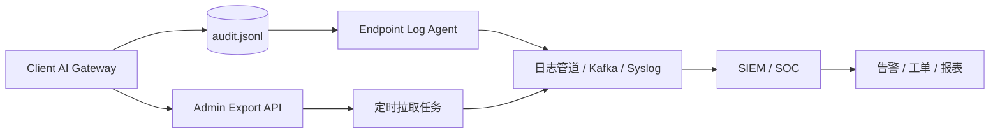

# 企业集中审计与 SIEM 对接

本文说明如何把客户端 AI 网关本机 Audit JSONL 接入企业集中日志、SIEM 或 SOC 平台。当前实现是单机 JSONL 持久化和管理 API 导出，尚未内置 Kafka、Syslog、OpenTelemetry exporter。

## 当前审计源

| 来源 | 路径 / API | 说明 |
| --- | --- | --- |
| 本机文件 | `audit_store_path`，默认 `data/audit.jsonl` | daemon 持久化的审计事件。 |
| 查询 API | `GET /gateway/v1/audit/events` | 需要 `admin` grant，支持分页和筛选。 |
| 导出 API | `GET /gateway/v1/audit/events/export` | 需要 `admin` grant，按当前筛选导出 JSONL。 |
| Trace 关联 | `trace_id` | 用于跳转 Trace 安全快照，不在 Audit 中重复保存完整请求内容。 |

## 推荐采集形态



推荐优先使用终端日志 Agent 采集 `audit.jsonl`，API 导出适合补偿、抽样和人工复盘。

## 字段映射

| Audit 字段 | SIEM 字段建议 | 说明 |
| --- | --- | --- |
| `id` | `event.id` | 审计事件唯一 ID。 |
| `created_at` | `@timestamp` | 事件创建时间，UTC。 |
| `trace_id` | `trace.id` | 关联 Trace。 |
| `app_id` | `user.id` 或 `client.app_id` | 调用方应用。 |
| `action` | `event.action` | 例如 `tool.invoke`、`provider.enabled`。 |
| `target` | `resource.id` | Provider、Tool、Policy 或 Trace 目标。 |
| `result` | `event.outcome` | `success`、`denied`、`failed`。 |
| `error` | `error.message` | 失败原因，不应包含密钥。 |
| `duration_ms` | `event.duration` | 建议转换为毫秒数值。 |
| `metadata` | `labels` 或 `event.attributes` | 结构化解释字段。 |

建议增加采集端补充字段：

| 字段 | 说明 |
| --- | --- |
| `host.name` | 终端主机名。 |
| `host.id` | 企业终端资产 ID。 |
| `gateway.version` | 网关版本或构建号。 |
| `gateway.config_hash` | 当前配置指纹。 |
| `tenant.id` | 企业租户或组织 ID。 |
| `source` | 固定为 `client-ai-gateway`。 |

## 重点 metadata

| 字段 | 适用事件 | 说明 |
| --- | --- | --- |
| `required_scopes` | 工具调用、权限试算 | 工具要求的 scope。 |
| `matched_grant` | 工具调用、权限试算 | 实际命中的 grant。 |
| `missing_grants` | 权限拒绝 | 缺失的 grant 列表。 |
| `origin` | 工具调用 | `builtin` 或 `mcp`。 |
| `server_id` | MCP 工具 | MCP server ID。 |
| `sandbox_required` | 工具调用 | 是否要求沙箱。当前应为 `false`。 |
| `policy_rule_id` | 策略试算、路由解释 | 命中的策略规则。 |
| `explain_chain` | 策略、路由、权限 | 可解释决策链。 |
| `provider_id` | Provider / 模型相关事件 | 上游 Provider。 |

## 脱敏与最小化

采集规则：

- 不采集 App Token、Provider API Key、Authorization header。
- Audit 只保留事件上下文，不重复保存完整 Prompt。
- 需要复盘请求内容时，通过 `trace_id` 查看 Trace 安全快照。
- Trace 快照应继续使用 `trace_redact_labels` 和 `trace_snapshot_max_chars`。
- 采集端对 `metadata` 做 allowlist 优先，不要把未知大对象无条件展开。
- 对 `error`、`target` 和 `metadata` 做最大长度限制，避免日志膨胀。

建议 allowlist：

```text
required_scopes
matched_grant
missing_grants
origin
server_id
sandbox_required
policy_rule_id
provider_id
explain_chain.stage
explain_chain.decision
explain_chain.reason
explain_chain.next_action
```

## 告警规则建议

| 场景 | 条件 | 严重度 |
| --- | --- | --- |
| 多次未授权 | `result=denied` 且 `action` 高频出现 | Medium |
| 工具 scope 缺失 | `action=tool.invoke` 且 `missing_grants` 非空 | Medium |
| MCP 占位工具被调用 | `origin=mcp` 且 `result=failed` | Low / Medium |
| Provider 被频繁启停 | `action=provider.enabled` 高频出现 | Medium |
| Provider 探测失败 | `action=provider.probe` 且 `result=failed` | Medium |
| 策略拒绝激增 | `policy_rule_id` 相同且 `result=denied` 高频出现 | High |
| 审计导出异常 | `action` 涉及导出且非管理员来源 | High |

## API 拉取示例

```powershell
curl "http://127.0.0.1:18765/gateway/v1/audit/events/export?limit=500&offset=0" `
  -H "Authorization: Bearer admin-token" `
  -o audit-events.jsonl
```

建议批处理任务记录上次 offset 或时间水位。当前 API 不支持按时间游标增量拉取，企业生产采集优先走文件 tail。

## 文件采集建议

- 配置固定 `audit_store_path`，避免 agent 路径漂移。
- 使用只读权限采集审计文件。
- 设置 `audit_retention_max`，避免端侧无限增长。
- 采集端应支持断点续传和本地缓冲。
- 采集失败时不影响网关主流程，但应产生终端运维告警。

## 验收标准

- SIEM 中能按 `trace.id`、`client.app_id`、`event.action`、`event.outcome` 查询。
- 工具调用事件能看到 `required_scopes`、`matched_grant`、`missing_grants`。
- Provider 管理事件能看到 `provider_id` 或目标 Provider。
- 策略试算事件能看到 `policy_rule_id` 或 `explain_chain`。
- 导出和集中日志中不出现 App Token、API Key、Authorization header。
- 本机 `audit_retention_max` 生效，日志管道中断后可恢复采集。

## 当前限制

- 没有内置 SIEM exporter。
- 没有时间游标或 sequence ID 增量 API。
- 没有企业租户字段，需要采集端补充。
- 没有集中审计 ACK 机制，网关不会等待远端确认。
- Audit metadata 仍按事件类型扩展，新增字段时需要同步采集 allowlist。
