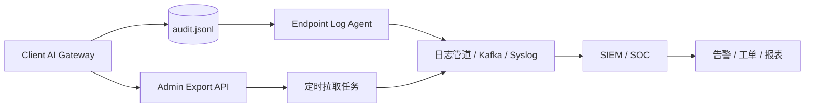
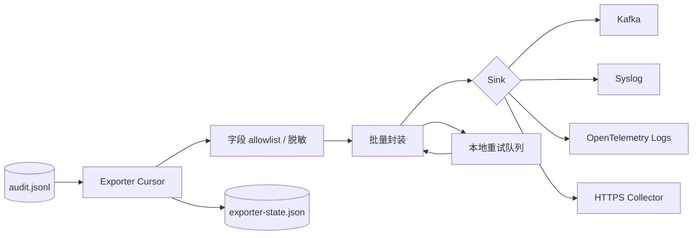

# 企业集中审计与 SIEM 对接

本文说明如何把客户端 AI 网关本机 Audit JSONL 接入企业集中日志、SIEM 或 SOC 平台。当前实现是单机 JSONL 持久化和管理 API 导出，尚未内置 Kafka、Syslog、OpenTelemetry exporter。

## 当前审计源

| 来源 | 路径 / API | 说明 |
| --- | --- | --- |
| 本机文件 | `audit_store_path`，默认 `data/audit.jsonl` | daemon 持久化的审计事件。 |
| 查询 API | `GET /gateway/v1/audit/events` | 需要 `admin` grant，支持分页和筛选。 |
| 导出 API | `GET /gateway/v1/audit/events/export` | 需要 `admin` grant，按当前筛选导出 JSONL。 |
| Trace 关联 | `trace_id` | 用于跳转 Trace 安全快照，不在 Audit 中重复保存完整请求内容。 |

## 推荐采集形态



推荐优先使用终端日志 Agent 采集 `audit.jsonl`，API 导出适合补偿、抽样和人工复盘。

## 内置 Exporter 设计草案

后续如果在 daemon 内置集中审计 exporter，建议保持“本地 Audit 写入优先，远端发送异步”的原则，避免 SIEM 故障阻塞模型和工具调用。



推荐配置形态：

```json
{
  "audit_exporter": {
    "enabled": false,
    "sink": "https",
    "endpoint": "https://siem.example.internal/ingest",
    "tenant_id": "tenant-a",
    "site_id": "cn-shanghai-office",
    "asset_id_env": "DEVICE_ASSET_ID",
    "batch_size": 100,
    "flush_interval_ms": 5000,
    "max_retry_queue": 10000,
    "state_path": "data/audit-exporter-state.json",
    "metadata_allowlist": [
      "required_scopes",
      "matched_grant",
      "missing_grants",
      "origin",
      "server_id",
      "sandbox_required",
      "policy_rule_id",
      "provider_id",
      "old_requests_per_minute",
      "requests_per_minute",
      "old_enabled",
      "enabled",
      "explain_chain.stage",
      "explain_chain.decision",
      "explain_chain.reason",
      "explain_chain.next_action"
    ]
  }
}
```

当前版本未实现该配置。它用于约束后续实现，不应被现有 daemon 读取或执行。

## 游标与增量语义

当前 API 只有 `limit` / `offset`，适合人工分页，不适合作为生产增量游标。内置 exporter 或外部采集器建议使用文件 offset + event id 双游标：

| 游标 | 用途 | 说明 |
| --- | --- | --- |
| `file_path` | 定位审计文件 | 配置变更或轮转后需要重新确认。 |
| `byte_offset` | 增量读取 | tail JSONL 时记录最后成功 ACK 的字节位置。 |
| `event_id` | 去重 | SIEM 侧按 `event.id` 幂等写入。 |
| `created_at` | 排序和延迟统计 | 不作为唯一游标，避免时钟回拨和同毫秒事件。 |
| `config_hash` | 源上下文 | 配置变化后辅助排障字段含义变化。 |

推荐 ACK 语义：

- 写入本地 `audit.jsonl` 成功即视为网关主流程完成。
- exporter 只有在远端 sink 返回成功后才推进 `byte_offset`。
- 远端失败时保留本地游标并指数退避重试。
- 如果本地文件因 retention 被裁剪而游标落后，应记录 `audit_exporter_gap` 运维事件，并从当前文件起点恢复。
- SIEM 侧应按 `event.id + host.id + tenant.id` 做幂等，允许至少一次投递。

## 企业租户字段

单机 Audit 事件不内置租户字段，企业采集层或未来 exporter 应补齐：

| 字段 | 必填 | 来源建议 |
| --- | --- | --- |
| `tenant.id` | 是 | 企业部署配置或 MDM 下发。 |
| `org.id` | 可选 | 集团 / 子公司组织树。 |
| `site.id` | 可选 | 办公区、区域或网络域。 |
| `host.id` | 是 | 终端资产 ID，优先来自 MDM / EDR。 |
| `host.name` | 是 | 主机名。 |
| `user.id` | 可选 | 当前登录用户，注意隐私合规。 |
| `gateway.instance_id` | 是 | 本机网关实例 ID，安装时生成。 |
| `gateway.version` | 是 | 构建版本。 |
| `gateway.config_hash` | 推荐 | 配置摘要，不上传完整配置。 |

租户字段不得从 App Token 推断，也不应把用户姓名、邮箱等个人信息作为唯一主键直接外发；需要时使用企业侧已批准的标识。

## 字段映射

| Audit 字段 | SIEM 字段建议 | 说明 |
| --- | --- | --- |
| `id` | `event.id` | 审计事件唯一 ID。 |
| `created_at` | `@timestamp` | 事件创建时间，UTC。 |
| `trace_id` | `trace.id` | 关联 Trace。 |
| `app_id` | `user.id` 或 `client.app_id` | 调用方应用。 |
| `action` | `event.action` | 例如 `tool.invoke`、`provider.enabled`。 |
| `target` | `resource.id` | Provider、Tool、Policy 或 Trace 目标。 |
| `result` | `event.outcome` | `success`、`denied`、`failed`。 |
| `error` | `error.message` | 失败原因，不应包含密钥。 |
| `duration_ms` | `event.duration` | 建议转换为毫秒数值。 |
| `metadata` | `labels` 或 `event.attributes` | 结构化解释字段。 |

建议增加采集端补充字段：

| 字段 | 说明 |
| --- | --- |
| `host.name` | 终端主机名。 |
| `host.id` | 企业终端资产 ID。 |
| `gateway.version` | 网关版本或构建号。 |
| `gateway.config_hash` | 当前配置指纹。 |
| `tenant.id` | 企业租户或组织 ID。 |
| `source` | 固定为 `client-ai-gateway`。 |

## 重点 metadata

| 字段 | 适用事件 | 说明 |
| --- | --- | --- |
| `required_scopes` | 工具调用、权限试算 | 工具要求的 scope。 |
| `matched_grant` | 工具调用、权限试算 | 实际命中的 grant。 |
| `missing_grants` | 权限拒绝 | 缺失的 grant 列表。 |
| `origin` | 工具调用 | `builtin` 或 `mcp`。 |
| `server_id` | MCP 工具 | MCP server ID。 |
| `sandbox_required` | 工具调用 | 是否要求沙箱。当前应为 `false`。 |
| `policy_rule_id` | 策略试算、路由解释 | 命中的策略规则。 |
| `explain_chain` | 策略、路由、权限 | 可解释决策链。 |
| `provider_id` | Provider / 模型相关事件 | 上游 Provider。 |

## 脱敏与最小化

采集规则：

- 不采集 App Token、Provider API Key、Authorization header。
- Audit 只保留事件上下文，不重复保存完整 Prompt。
- 需要复盘请求内容时，通过 `trace_id` 查看 Trace 安全快照。
- Trace 快照应继续使用 `trace_redact_labels` 和 `trace_snapshot_max_chars`。
- 采集端对 `metadata` 做 allowlist 优先，不要把未知大对象无条件展开。
- 对 `error`、`target` 和 `metadata` 做最大长度限制，避免日志膨胀。

建议 allowlist：

```text
required_scopes
matched_grant
missing_grants
origin
server_id
sandbox_required
policy_rule_id
provider_id
explain_chain.stage
explain_chain.decision
explain_chain.reason
explain_chain.next_action
old_requests_per_minute
requests_per_minute
old_enabled
enabled
```

禁止默认展开：

| 字段 | 原因 |
| --- | --- |
| 完整 `request` / prompt | 应只通过 Trace 安全快照复盘。 |
| Authorization / token / api_key | 明确敏感凭证。 |
| 任意未知 metadata 对象 | 可能包含大对象或敏感上下文。 |
| 原始工具输出 | 可能包含本地环境信息，应由工具自行最小化。 |
| 完整配置文件 | 可能包含路径、内网地址或环境变量名。 |

## 告警规则建议

| 场景 | 条件 | 严重度 |
| --- | --- | --- |
| 多次未授权 | `result=denied` 且 `action` 高频出现 | Medium |
| 工具 scope 缺失 | `action=tool.invoke` 且 `missing_grants` 非空 | Medium |
| MCP 占位工具被调用 | `origin=mcp` 且 `result=failed` | Low / Medium |
| Provider 被频繁启停 | `action=provider.enabled` 高频出现 | Medium |
| Provider 探测失败 | `action=provider.probe` 且 `result=failed` | Medium |
| 策略拒绝激增 | `policy_rule_id` 相同且 `result=denied` 高频出现 | High |
| 审计导出异常 | `action` 涉及导出且非管理员来源 | High |

## API 拉取示例

```powershell
curl "http://127.0.0.1:18765/gateway/v1/audit/events/export?limit=500&offset=0" `
  -H "Authorization: Bearer admin-token" `
  -o audit-events.jsonl
```

建议批处理任务记录上次 offset 或时间水位。当前 API 不支持按时间游标增量拉取，企业生产采集优先走文件 tail。

## 文件采集建议

- 配置固定 `audit_store_path`，避免 agent 路径漂移。
- 使用只读权限采集审计文件。
- 设置 `audit_retention_max`，避免端侧无限增长。
- 采集端应支持断点续传和本地缓冲。
- 采集失败时不影响网关主流程，但应产生终端运维告警。

## 失败、背压与降级

集中审计不可用时，网关行为建议如下：

| 场景 | 网关主流程 | Exporter 行为 | 告警建议 |
| --- | --- | --- | --- |
| SIEM endpoint 超时 | 不阻塞 | 指数退避，保留游标 | Medium |
| 远端 4xx | 不阻塞 | 停止当前 sink，保留失败样本 | High |
| 远端 5xx | 不阻塞 | 重试并限制队列 | Medium |
| 本地重试队列满 | 不阻塞 | 丢弃最旧未发送批次或暂停读取 | High |
| audit 文件被裁剪 | 不阻塞 | 记录 gap，从文件起点恢复 | High |
| metadata 脱敏失败 | 不发送该事件 | 记录本地 exporter error | High |

推荐背压上限：

- 单批最大事件数：`100` 到 `500`。
- 单事件序列化后大小：建议不超过 `32KB`。
- 本地重试队列：按事件数和磁盘大小双限制。
- flush 超时：建议 `3s` 到 `10s`。
- exporter 不应持有 Audit Store 写锁执行网络请求。

## Sink 映射建议

| Sink | 适用场景 | 注意事项 |
| --- | --- | --- |
| Endpoint Agent tail | 当前首选 | 复用企业现有日志采集，不改 daemon。 |
| HTTPS Collector | 轻量企业接入 | 需要 mTLS 或设备证书，避免只靠共享 token。 |
| Syslog | 传统 SOC | 注意 JSON 转义、消息大小和 TLS。 |
| Kafka | 大规模企业 | 需要本地缓冲、分区键和 ACK 策略。 |
| OpenTelemetry Logs | 云原生日志 | 需要明确 resource attributes 和重试策略。 |

## 验收标准

- SIEM 中能按 `trace.id`、`client.app_id`、`event.action`、`event.outcome` 查询。
- 工具调用事件能看到 `required_scopes`、`matched_grant`、`missing_grants`。
- Provider 管理事件能看到 `provider_id` 或目标 Provider。
- 策略试算事件能看到 `policy_rule_id` 或 `explain_chain`。
- 导出和集中日志中不出现 App Token、API Key、Authorization header。
- 本机 `audit_retention_max` 生效，日志管道中断后可恢复采集。

## 当前限制

- 没有内置 SIEM exporter。
- 没有时间游标或 sequence ID 增量 API。
- 没有企业租户字段，需要采集端补充。
- 没有集中审计 ACK 机制，网关不会等待远端确认。
- Audit metadata 仍按事件类型扩展，新增字段时需要同步采集 allowlist。
