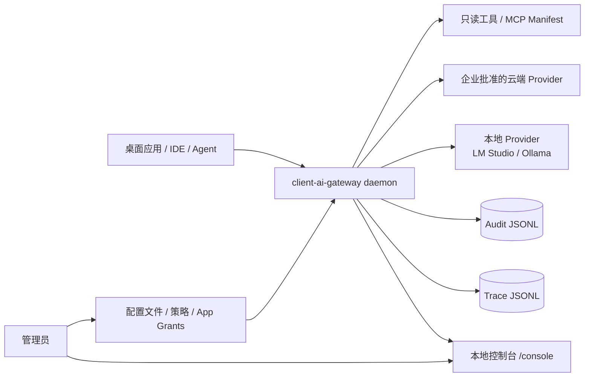

# 企业部署形态

本文描述客户端 AI 网关从本地开发原型走向企业桌面 AI 底座时的推荐部署方式、边界和运维检查点。

## 适用场景

- AI PC：作为本机应用、Copilot、Agent 和本地模型运行时之间的统一入口。
- 本地开发环境：为 IDE、CLI Agent、调试脚本提供 OpenAI 兼容入口、Trace 和策略试算。
- 企业桌面：在员工终端上统一接入本地模型、云端模型、只读工具目录和 MCP Manifest。
- 受控内网：通过本地策略限制敏感数据进入云端 Provider，并保留可导出的审计证据。

## 部署拓扑

当前 MVP 推荐以单机 daemon 方式运行，监听 `127.0.0.1:18765`。企业分发时可由桌面管理系统、登录脚本或本机服务管理器拉起。不要默认监听 `0.0.0.0`，除非已经完成网络 ACL、认证、日志留存和变更审批。

## 运行目录

建议把运行文件拆成三类：

| 类型 | 示例 | 说明 |
| --- | --- | --- |
| 程序 | `gateway-daemon` | 只读部署，随版本升级替换。 |
| 配置 | `configs/dev.json` 或企业下发配置 | 包含 App、Provider、Policy、Tool、MCP Manifest。 |
| 数据 | `data/traces.jsonl`、`data/audit.jsonl` | 本机可观测证据，需纳入留存与清理策略。 |

## 配置下发

企业环境建议由中心配置系统生成配置文件，再下发到终端。配置应至少区分：

- App 与 token：不同桌面应用、IDE 插件、Agent 使用不同 App ID。
- Grants：用 `chat`、`admin`、`tool`、`tool:<scope>` 控制能力边界。
- Provider：显式区分 `local` 与 `cloud`，云端 Provider 仅配置企业批准的上游。
- Policy：对敏感数据、指定模型、指定应用设置 `force_local` 或 `deny_cloud_for_sensitive`。
- Trace/Audit：设置持久化路径和 `*_retention_max`，避免无限增长。

## 运维检查

上线前至少检查：

- `GET /healthz` 返回 200。
- `GET /gateway/v1/runtime/health` 中 Provider、Trace、Audit、MCP Runtime 状态可读。
- 控制台 `/console` 可打开，且列表分页、筛选、导出可用。
- `go test ./...` 在交付构建前通过。
- 配置重载失败时旧运行时快照仍可用。

## 当前边界

- MCP 当前只加载 Manifest，不启动外部 MCP Server。
- 工具调用当前只开放已注册的只读工具。
- 不执行任意本地命令。
- 控制台和管理 API 依赖 App token / admin grant，不应暴露完整 token。
- JSONL 存储适合 MVP 和单机验证，大规模企业归档需要接入集中日志或 SIEM。

