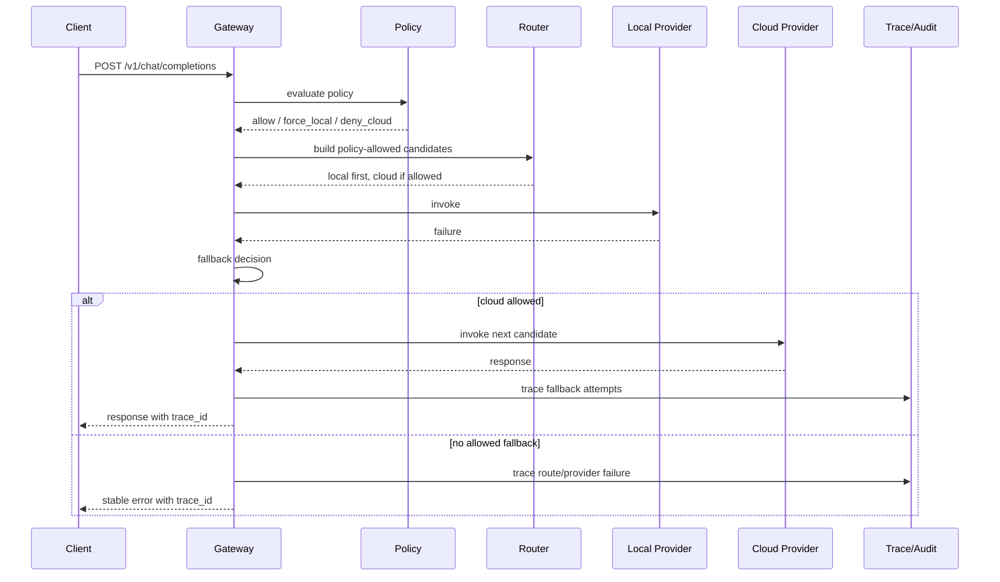

# 失败降级机制

本文说明客户端 AI 网关在 Provider 失败、策略限制、健康状态异常和工具不可用时的降级与失败关闭行为。

## 聊天请求降级链路

## 降级决策

当前降级由候选 Provider 顺序和策略共同决定：

- Router 只返回启用、健康可路由、支持目标模型、且符合 Policy 的 Provider。
- 本地 Provider 失败后，如果还有策略允许的候选 Provider，则尝试下一个。
- 如果 Policy 禁止云端，例如敏感数据命中 `deny_cloud_for_sensitive`，则不会降级到云端。
- 没有更多候选时返回稳定错误，并在 Trace 中记录失败原因。

## 失败关闭场景

| 场景 | 行为 |
| --- | --- |
| Token 无效或缺少 Grant | 拒绝请求，返回 `unauthorized` 或权限拒绝结果。 |
| Policy `deny` | 路由前拒绝，返回 `policy_denied`。 |
| Provider 全部不可路由 | 返回 `route_failed`。 |
| Provider 调用失败且无候选 | 返回 `provider_failed` 或分类 Provider 错误。 |
| MCP 工具 Manifest 被调用 | 返回 `tool_unavailable`，写入 Trace/Audit。 |
| 工具不是只读 | 返回 `tool_denied`。 |
| 工具缺少 scope | 返回 `tool_scope_denied`。 |

## 可观测证据

Trace 中重点查看：

- `status`
- `provider_id`
- `policy`
- `fallbacks`
- `events`
- `error`

Audit 中重点查看：

- `action`
- `result`
- `trace_id`
- `metadata.explain_chain`
- `metadata.missing_grants`
- `metadata.required_scopes`

## 配置建议

- 对敏感数据统一打 `data_labels=["sensitive"]`，并配置 `deny_cloud_for_sensitive`。
- 本地模型优先的场景使用 `force_local`。
- 云端 Provider 必须显式配置 `class="cloud"`，便于策略识别。
- Provider health 处于 `unhealthy` 时不参与路由。
- 对关键应用使用细粒度 `tool:<scope>`，避免直接授予 `tool`。

## 当前限制

- 降级顺序当前由 Provider 配置顺序和 Router 候选构建决定，尚未提供独立优先级字段。
- 当前未实现熔断窗口、预算控制、速率限制和用户级配额。
- JSONL Trace/Audit 适合单机排障，企业集中审计需要后续接入日志管道。

