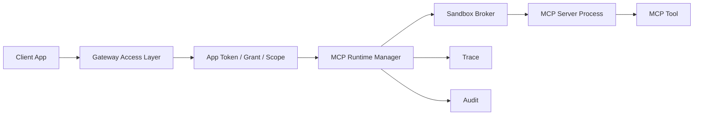
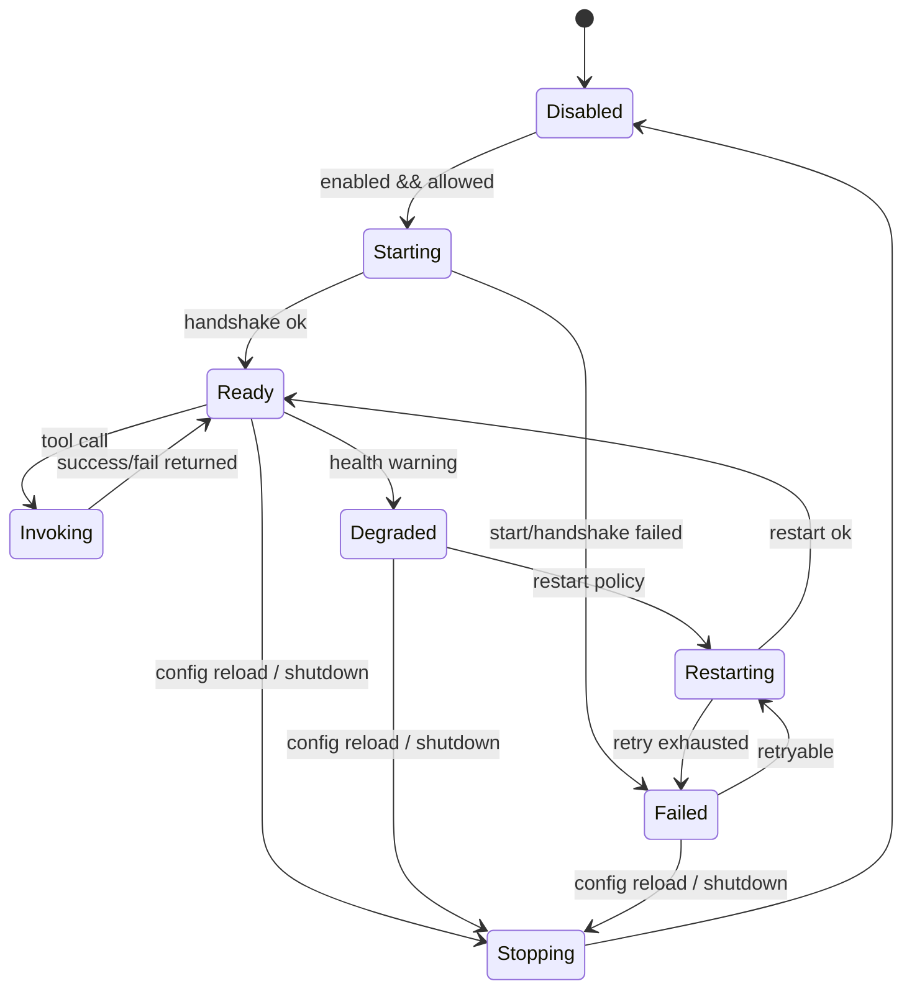

# MCP 真实运行时设计草案

本文定义从当前 Manifest-only MCP 目录演进到真实 MCP Server 执行前必须补齐的架构、权限、沙箱、审计和降级要求。当前版本仍禁止启动外部 MCP Server。

## 当前边界

当前 `mcp_runtime` 只支持：

- `mode=manifest_only`
- `mode=disabled`
- 加载 server/tool manifest
- 展示 MCP 目录、scope、风险等级和启用状态
- 调用 MCP 工具时返回 `tool_unavailable`

以下能力仍未启用：

- `stdio`、`direct`、`sandboxed` 执行模式
- 外部命令启动
- 插件二进制加载
- 可写工具
- 沙箱授权弹窗

## 目标进程模型



建议拆分：

| 组件 | 责任 |
| --- | --- |
| Access Layer | Token、scope、只读边界、请求体大小限制。 |
| MCP Runtime Manager | Server 生命周期、健康检查、超时、重启策略。 |
| Sandbox Broker | 进程隔离、环境变量白名单、文件/网络权限控制。 |
| Permission Prompt | 首次授权、敏感 scope 二次确认、企业策略覆盖。 |
| Audit Writer | 记录启动、授权、调用、拒绝、失败和降级。 |

## 运行时状态机

MCP Server 生命周期建议显式建模，避免“启动失败但仍可路由”的模糊状态：



建议状态字段：

| 字段 | 说明 |
| --- | --- |
| `server_id` | MCP server ID。 |
| `status` | `disabled`、`starting`、`ready`、`degraded`、`failed`、`restarting`、`stopping`。 |
| `pid` | 子进程 ID，可在集中审计前脱敏或映射。 |
| `sandbox_id` | 沙箱实例 ID。 |
| `started_at` | 最近一次启动时间。 |
| `last_heartbeat_at` | 最近一次健康心跳。 |
| `restart_count` | 当前窗口内重启次数。 |
| `last_error_code` | 稳定错误码。 |
| `last_error` | 脱敏后的错误描述。 |

`ready` 之前不得接受工具调用；`failed` 和 `degraded` 应进入运行问题汇总。

## 配置演进

建议未来扩展字段：

```json
{
  "mcp_runtime": {
    "enabled": true,
    "mode": "sandboxed",
    "default_timeout_ms": 3000,
    "max_processes": 4,
    "servers": [
      {
        "id": "desktop-context",
        "command": "desktop-context-mcp.exe",
        "args": ["--stdio"],
        "env_allowlist": ["USERPROFILE"],
        "network": "none",
        "file_read_allowlist": ["%USERPROFILE%/Documents"],
        "file_write_allowlist": [],
        "tools": []
      }
    ]
  }
}
```

当前配置加载仍必须拒绝 `stdio`、`direct`、`sandboxed`，直到以上控制面完成。

## Broker API 边界

Sandbox Broker 是唯一允许启动 MCP Server 的组件。Gateway 和 Tool runtime 不应直接执行命令。

建议内部接口：

```go
type Broker interface {
    Start(context.Context, ServerSpec) (ProcessHandle, error)
    Stop(context.Context, string) error
    Invoke(context.Context, InvokeRequest) (InvokeResult, error)
    Health(context.Context, string) (ProcessHealth, error)
}

type ServerSpec struct {
    ServerID          string
    Command           string
    Args              []string
    Env               map[string]string
    WorkDir           string
    NetworkPolicy     string
    FileReadAllowlist  []string
    FileWriteAllowlist []string
    TimeoutMS         int
    MaxOutputBytes    int
}
```

Broker 必须负责：

- 命令路径解析和签名/来源校验结果检查。
- 清空默认环境变量，只注入 allowlist。
- 固定工作目录，禁止相对路径逃逸。
- 注入调用超时、输出大小、进程数和内存上限。
- 将进程 stderr/stdout 做大小限制和脱敏后再进入日志。
- 进程退出时清理临时目录和句柄。

Gateway 侧只保存 `ProcessHandle` 的逻辑 ID，不把原始命令行和完整环境变量写入 Audit。

## MCP JSON-RPC 调用边界

真实 MCP Server 建议只支持 stdio JSON-RPC 的受控子集：

| 阶段 | 方法 | 要求 |
| --- | --- | --- |
| 初始化 | `initialize` | 必须带协议版本、client 信息和能力声明。 |
| 工具发现 | `tools/list` | 返回工具必须与配置 manifest 匹配或被配置 allowlist 接受。 |
| 工具调用 | `tools/call` | 只能调用已注册、已授权、只读工具。 |
| 心跳 | `ping` 或轻量方法 | 不能触发昂贵或写操作。 |

禁止透传：

- 任意未识别 JSON-RPC method。
- server 主动请求访问文件、网络或凭证的非白名单能力。
- 未在 manifest 中声明的 tool。
- 超过 `max_output_bytes` 的响应体。
- 含完整文件内容、密钥、Authorization header 的错误详情。

## 权限与授权

执行前必须同时满足：

- App 具备 `tool` 或全部 `tool:<scope>` grant。
- Tool manifest `read_only=true`。
- Tool manifest `sandbox_required=true` 时，运行时必须进入沙箱。
- 企业策略未禁用该 server、tool、scope 或风险等级。
- 首次调用或高风险 scope 需要授权弹窗或企业预授权。

授权记录建议写入 Audit：

| 字段 | 说明 |
| --- | --- |
| `action=mcp.authorize` | 授权确认事件。 |
| `target` | MCP server 或 tool ID。 |
| `metadata.scopes` | 本次授权 scope。 |
| `metadata.prompt_result` | `approved`、`denied`、`enterprise_preapproved`。 |
| `metadata.expires_at` | 授权过期时间。 |

## 授权缓存与企业预授权

授权建议分三层判断：

1. App grant：`tool` 或 `tool:<scope>`。
2. 企业策略：按 server、tool、scope、risk_level、tenant、host 分配 allow/deny。
3. 本机授权缓存：记录用户或管理员对某个 server/tool/scope 的短期批准。

授权缓存建议字段：

| 字段 | 说明 |
| --- | --- |
| `grant_id` | 授权记录 ID。 |
| `server_id` / `tool_id` | 授权对象。 |
| `app_id` | 调用方应用。 |
| `scopes` | 授权 scope。 |
| `risk_level` | 授权时工具风险等级。 |
| `decision` | `approved`、`denied`、`enterprise_preapproved`。 |
| `expires_at` | 过期时间。 |
| `policy_version` | 企业策略版本。 |
| `created_by` | `user`、`admin`、`enterprise_policy`。 |

缓存命中仍需写入轻量 Audit，避免“静默授权”无法追踪。

## 沙箱要求

最低要求：

- 独立子进程，不与 gateway daemon 共享命令执行入口。
- 工作目录固定到插件目录或临时目录。
- 环境变量默认清空，只允许 allowlist。
- 文件读取和网络访问默认拒绝。
- 写权限默认拒绝，除非未来明确支持可写工具。
- 单次调用必须有超时和输出大小限制。
- 进程退出、超时、崩溃必须可观测。

建议资源限制：

| 资源 | 默认建议 |
| --- | --- |
| 单次调用超时 | `3s` 到 `10s`，高风险工具不允许无限等待。 |
| 单次输出大小 | `64KB` 到 `1MB`，超限截断或拒绝。 |
| 单 server 并发 | 默认 `1`，明确验证后再提高。 |
| 总进程数 | 受 `max_processes` 控制。 |
| 环境变量 | 默认空，仅 allowlist。 |
| 网络 | 默认 `none`。 |
| 文件读 | 默认空，仅 allowlist。 |
| 文件写 | 默认空，当前不开放。 |

Windows 落地可优先考虑 Job Object、低完整性进程、受控工作目录和防火墙/代理策略；macOS 可考虑 sandbox-exec/launchd 约束；Linux 可考虑 namespace、seccomp、cgroup。跨平台实现应先抽象 Broker 接口，再分平台落地。

## 审计字段

MCP 工具调用 Audit metadata 建议补充：

| 字段 | 说明 |
| --- | --- |
| `origin=mcp` | 工具来源。 |
| `server_id` | MCP server ID。 |
| `tool_id` | MCP tool ID。 |
| `sandbox_id` | 沙箱实例 ID。 |
| `process_id` | 进程 ID，可选；集中审计可脱敏或映射。 |
| `required_scopes` | 工具所需 scope。 |
| `matched_grant` | 命中的 grant。 |
| `timeout_ms` | 调用超时。 |
| `output_bytes` | 输出大小。 |
| `prompt_result` | 授权结果。 |

错误和 metadata 不得包含命令行密钥、完整环境变量、完整文件内容或 Prompt 明文。

## 失败关闭

| 场景 | 行为 |
| --- | --- |
| Server 未启用 | 返回 `tool_unavailable`。 |
| scope 缺失 | 返回 `tool_scope_denied`。 |
| 非只读工具 | 返回 `tool_denied`。 |
| 沙箱不可用 | 返回 `tool_unavailable`，不降级到非沙箱执行。 |
| 授权被拒绝 | 返回 `tool_denied`。 |
| 进程启动失败 | 返回 `tool_unavailable`。 |
| 调用超时 | 返回稳定 MCP 超时错误，写入 Trace/Audit。 |
| 输出超限 | 截断或拒绝，并写入 Trace/Audit。 |

稳定错误码建议：

| Code | HTTP | 说明 |
| --- | --- | --- |
| `mcp_runtime_unavailable` | 503 | MCP runtime 未启用或 Broker 不可用。 |
| `mcp_server_unavailable` | 503 | Server 未启动、未 ready 或已禁用。 |
| `mcp_authorization_denied` | 403 | 用户或企业策略拒绝。 |
| `mcp_sandbox_required` | 503 | 工具要求沙箱但沙箱不可用。 |
| `mcp_start_failed` | 503 | 进程启动或握手失败。 |
| `mcp_call_timeout` | 504 | 调用超时。 |
| `mcp_output_limit_exceeded` | 502 | 输出超过限制。 |
| `mcp_invalid_response` | 502 | JSON-RPC 响应无效。 |

当前 manifest-only 仍统一返回现有 `tool_unavailable`，这些 MCP 专用错误码只作为真实运行时实现时的目标契约。

## 分阶段实施路线

| 阶段 | 目标 | 关键交付 | 不做 |
| --- | --- | --- | --- |
| M0 | 保持 manifest-only | 当前目录、过滤、失败关闭、Trace/Audit | 不启动进程。 |
| M1 | Broker 空实现 | 接口、状态机、配置拒绝测试、runtime health 字段 | 不执行 MCP。 |
| M2 | 单 server sandbox PoC | 受控 stdio、initialize、tools/list、超时、输出限制 | 不开放可写工具。 |
| M3 | 授权闭环 | 企业预授权、本机授权缓存、`mcp.authorize` Audit、控制台状态 | 不做长期后台任务。 |
| M4 | 多 server 生产化 | 重启策略、资源配额、集中审计字段、跨平台 Broker | 不默认信任第三方插件。 |

每个阶段都必须保持失败关闭：新能力不可用时返回稳定错误，不回退到非沙箱执行。

## 验收门槛

启用真实 MCP 前至少需要：

- Config 测试覆盖执行模式、命令字段、沙箱字段和非法组合。
- Access 测试覆盖 scope、只读、授权拒绝和沙箱失败。
- Runtime 测试覆盖进程启动、超时、退出、重启和输出限制。
- Audit 测试覆盖 `mcp.authorize`、`tool.invoke`、失败事件和脱敏。
- UI smoke 覆盖 MCP 目录、授权状态和失败详情。
- 安全清单更新为真实 MCP 执行版本。

## 当前决策

在沙箱、授权、审计和企业策略完成前，保持：

- 不执行 MCP Server。
- 不读取 command 字段。
- `mcp_runtime.mode` 只允许 `manifest_only` 或 `disabled`。
- MCP 工具调用失败关闭为 `tool_unavailable`。
