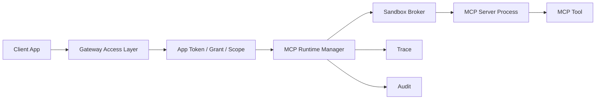

# MCP 真实运行时设计草案

本文定义从当前 Manifest-only MCP 目录演进到真实 MCP Server 执行前必须补齐的架构、权限、沙箱、审计和降级要求。当前版本仍禁止启动外部 MCP Server。

## 当前边界

当前 `mcp_runtime` 只支持：

- `mode=manifest_only`
- `mode=disabled`
- 加载 server/tool manifest
- 展示 MCP 目录、scope、风险等级和启用状态
- 调用 MCP 工具时返回 `tool_unavailable`

以下能力仍未启用：

- `stdio`、`direct`、`sandboxed` 执行模式
- 外部命令启动
- 插件二进制加载
- 可写工具
- 沙箱授权弹窗

## 目标进程模型



建议拆分：

| 组件 | 责任 |
| --- | --- |
| Access Layer | Token、scope、只读边界、请求体大小限制。 |
| MCP Runtime Manager | Server 生命周期、健康检查、超时、重启策略。 |
| Sandbox Broker | 进程隔离、环境变量白名单、文件/网络权限控制。 |
| Permission Prompt | 首次授权、敏感 scope 二次确认、企业策略覆盖。 |
| Audit Writer | 记录启动、授权、调用、拒绝、失败和降级。 |

## 配置演进

建议未来扩展字段：

```json
{
  "mcp_runtime": {
    "enabled": true,
    "mode": "sandboxed",
    "default_timeout_ms": 3000,
    "max_processes": 4,
    "servers": [
      {
        "id": "desktop-context",
        "command": "desktop-context-mcp.exe",
        "args": ["--stdio"],
        "env_allowlist": ["USERPROFILE"],
        "network": "none",
        "file_read_allowlist": ["%USERPROFILE%/Documents"],
        "file_write_allowlist": [],
        "tools": []
      }
    ]
  }
}
```

当前配置加载仍必须拒绝 `stdio`、`direct`、`sandboxed`，直到以上控制面完成。

## 权限与授权

执行前必须同时满足：

- App 具备 `tool` 或全部 `tool:<scope>` grant。
- Tool manifest `read_only=true`。
- Tool manifest `sandbox_required=true` 时，运行时必须进入沙箱。
- 企业策略未禁用该 server、tool、scope 或风险等级。
- 首次调用或高风险 scope 需要授权弹窗或企业预授权。

授权记录建议写入 Audit：

| 字段 | 说明 |
| --- | --- |
| `action=mcp.authorize` | 授权确认事件。 |
| `target` | MCP server 或 tool ID。 |
| `metadata.scopes` | 本次授权 scope。 |
| `metadata.prompt_result` | `approved`、`denied`、`enterprise_preapproved`。 |
| `metadata.expires_at` | 授权过期时间。 |

## 沙箱要求

最低要求：

- 独立子进程，不与 gateway daemon 共享命令执行入口。
- 工作目录固定到插件目录或临时目录。
- 环境变量默认清空，只允许 allowlist。
- 文件读取和网络访问默认拒绝。
- 写权限默认拒绝，除非未来明确支持可写工具。
- 单次调用必须有超时和输出大小限制。
- 进程退出、超时、崩溃必须可观测。

## 审计字段

MCP 工具调用 Audit metadata 建议补充：

| 字段 | 说明 |
| --- | --- |
| `origin=mcp` | 工具来源。 |
| `server_id` | MCP server ID。 |
| `tool_id` | MCP tool ID。 |
| `sandbox_id` | 沙箱实例 ID。 |
| `process_id` | 进程 ID，可选；集中审计可脱敏或映射。 |
| `required_scopes` | 工具所需 scope。 |
| `matched_grant` | 命中的 grant。 |
| `timeout_ms` | 调用超时。 |
| `output_bytes` | 输出大小。 |
| `prompt_result` | 授权结果。 |

错误和 metadata 不得包含命令行密钥、完整环境变量、完整文件内容或 Prompt 明文。

## 失败关闭

| 场景 | 行为 |
| --- | --- |
| Server 未启用 | 返回 `tool_unavailable`。 |
| scope 缺失 | 返回 `tool_scope_denied`。 |
| 非只读工具 | 返回 `tool_denied`。 |
| 沙箱不可用 | 返回 `tool_unavailable`，不降级到非沙箱执行。 |
| 授权被拒绝 | 返回 `tool_denied`。 |
| 进程启动失败 | 返回 `tool_unavailable`。 |
| 调用超时 | 返回稳定 MCP 超时错误，写入 Trace/Audit。 |
| 输出超限 | 截断或拒绝，并写入 Trace/Audit。 |

## 验收门槛

启用真实 MCP 前至少需要：

- Config 测试覆盖执行模式、命令字段、沙箱字段和非法组合。
- Access 测试覆盖 scope、只读、授权拒绝和沙箱失败。
- Runtime 测试覆盖进程启动、超时、退出、重启和输出限制。
- Audit 测试覆盖 `mcp.authorize`、`tool.invoke`、失败事件和脱敏。
- UI smoke 覆盖 MCP 目录、授权状态和失败详情。
- 安全清单更新为真实 MCP 执行版本。

## 当前决策

在沙箱、授权、审计和企业策略完成前，保持：

- 不执行 MCP Server。
- 不读取 command 字段。
- `mcp_runtime.mode` 只允许 `manifest_only` 或 `disabled`。
- MCP 工具调用失败关闭为 `tool_unavailable`。
