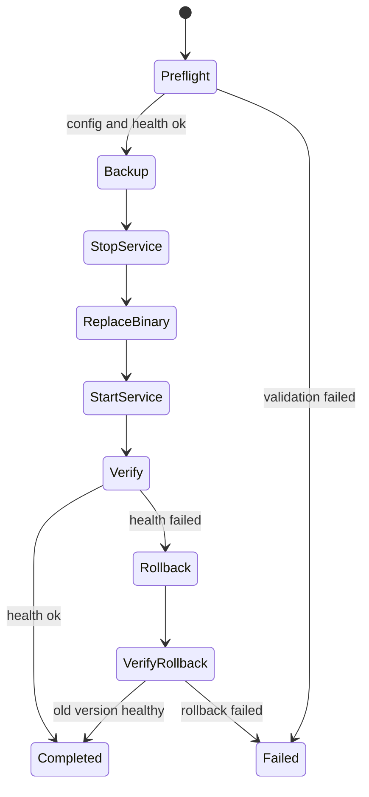

# 安装包与服务管理设计草案

本文定义客户端 AI 网关从本地 `go run` 走向企业桌面分发时的安装包、服务管理、升级、回滚和运维边界。当前版本尚未提供正式安装器或服务安装脚本。

## 目标形态

| 平台 | 推荐形态 | 说明 |
| --- | --- | --- |
| Windows | Windows Service 或登录后用户态托管进程 | 企业桌面优先服务化；开发环境可手动运行。 |
| macOS | `launchd` LaunchAgent | 以当前用户身份运行，避免默认 root。 |
| Linux | systemd user service | 开发机或受控终端可选。 |

默认监听仍应保持 `127.0.0.1`，不要在安装包里默认暴露到局域网。

## 交付包结构

建议安装包按“程序、配置模板、运维脚本、校验材料”拆分：

```text
client-ai-gateway-{version}-{platform}-{arch}.zip
  bin/
    gateway-daemon(.exe)
  configs/
    gateway.example.json
  scripts/
    install-service.ps1
    uninstall-service.ps1
    health-check.ps1
    upgrade.ps1
  docs/
    README-enterprise.md
    CHANGELOG.md
  VERSION
  checksums.txt
  manifest.json
```

`manifest.json` 建议字段：

```json
{
  "name": "client-ai-gateway",
  "version": "0.1.0",
  "platform": "windows",
  "arch": "amd64",
  "build_time": "2026-06-09T00:00:00Z",
  "binary": "bin/gateway-daemon.exe",
  "config_schema_version": "v1",
  "min_config_schema_version": "v1",
  "checksum_algorithm": "sha256"
}
```

当前仓库尚未提供这些脚本和安装包；上述结构是后续正式打包的目标契约。

## 目录布局

Windows 建议：

```text
C:\Program Files\ClientAIGateway\
  gateway-daemon.exe
  configs\
    gateway.json
  VERSION
C:\ProgramData\ClientAIGateway\
  data\
    traces.jsonl
    audit.jsonl
  logs\
```

macOS 建议：

```text
/Applications/ClientAIGateway/
  gateway-daemon
  configs/gateway.json
~/Library/Application Support/ClientAIGateway/
  data/traces.jsonl
  data/audit.jsonl
  logs/
```

原则：

- 程序目录只读。
- 配置由企业配置系统下发。
- Trace/Audit 写入数据目录。
- 日志和审计文件进入企业采集策略。

## Windows 服务草案

服务参数建议：

| 项 | 建议 |
| --- | --- |
| Service Name | `ClientAIGateway` |
| Display Name | `Client AI Gateway` |
| Binary | `gateway-daemon.exe -config C:\Program Files\ClientAIGateway\configs\gateway.json` |
| Account | 低权限本地账号或当前用户托管，不默认 LocalSystem。 |
| Startup | Automatic delayed 或企业策略控制。 |
| Recovery | 首次/二次失败自动重启，连续失败后告警。 |

安装脚本必须检查：

- 配置文件存在且可读。
- `listen_addr` 不为 `0.0.0.0`，除非显式企业审批。
- 数据目录可写。
- 旧进程已停止。
- 新版本 `/healthz` 可用。

脚本接口建议：

```powershell
.\install-service.ps1 `
  -InstallDir "C:\Program Files\ClientAIGateway" `
  -DataDir "C:\ProgramData\ClientAIGateway" `
  -ConfigPath "C:\Program Files\ClientAIGateway\configs\gateway.json" `
  -ServiceName "ClientAIGateway"

.\health-check.ps1 -BaseUrl "http://127.0.0.1:18765"

.\upgrade.ps1 `
  -PackagePath ".\client-ai-gateway-0.2.0-windows-amd64.zip" `
  -InstallDir "C:\Program Files\ClientAIGateway" `
  -DataDir "C:\ProgramData\ClientAIGateway"
```

脚本必须支持 `-WhatIf` 或 dry-run 模式，输出将执行的文件复制、服务注册、停止、启动和回滚动作，但不修改系统。

## macOS launchd 草案

LaunchAgent 建议：

```xml
<key>Label</key>
<string>com.client-ai-gateway.daemon</string>
<key>ProgramArguments</key>
<array>
  <string>/Applications/ClientAIGateway/gateway-daemon</string>
  <string>-config</string>
  <string>/Applications/ClientAIGateway/configs/gateway.json</string>
</array>
<key>RunAtLoad</key>
<true/>
<key>KeepAlive</key>
<true/>
```

不要默认使用 LaunchDaemon/root，除非企业明确要求并完成权限审查。

建议 plist 额外包含：

```xml
<key>StandardOutPath</key>
<string>~/Library/Logs/ClientAIGateway/gateway.log</string>
<key>StandardErrorPath</key>
<string>~/Library/Logs/ClientAIGateway/gateway.err.log</string>
<key>EnvironmentVariables</key>
<dict>
  <key>CLIENT_AI_GATEWAY_ENV</key>
  <string>enterprise</string>
</dict>
```

配置路径、数据路径和日志路径应由安装脚本渲染，不要在二进制中硬编码。

## Linux systemd user 草案

```ini
[Unit]
Description=Client AI Gateway
After=network.target

[Service]
ExecStart=%h/.local/share/client-ai-gateway/gateway-daemon -config %h/.config/client-ai-gateway/gateway.json
Restart=on-failure
RestartSec=5
NoNewPrivileges=true

[Install]
WantedBy=default.target
```

Linux 形态主要面向开发机或受控终端，不建议在未完成企业策略前默认作为服务器进程暴露。

## 升级与回滚

推荐流程：

1. 停止服务。
2. 备份当前二进制、配置和 VERSION。
3. 替换二进制。
4. 校验配置加载。
5. 启动服务。
6. 调用 `/healthz` 和 `/gateway/v1/runtime/health`。
7. 失败则恢复旧二进制并重启。

升级包必须包含：

- 版本号。
- 构建时间。
- 校验和。
- 变更说明。
- 最小兼容配置版本。

升级状态机：



Preflight 必须检查：

| 检查 | 失败行为 |
| --- | --- |
| 包 checksum / 签名 | 停止升级。 |
| manifest 平台和架构 | 停止升级。 |
| 配置 JSON 可解析 | 停止升级。 |
| `listen_addr` 安全 | 未审批的 `0.0.0.0` 停止升级。 |
| 数据目录可写 | 停止升级。 |
| 当前服务可停止 | 停止升级或进入人工处理。 |
| 端口未被其它进程占用 | 停止升级。 |

回滚必须恢复：

- 旧二进制。
- 旧 `VERSION`。
- 上一次可用配置。
- 服务启动参数。

Trace/Audit 数据目录默认不回滚、不删除。

## 配置迁移

如果未来配置 schema 变化，升级包应提供迁移计划：

| 字段 | 说明 |
| --- | --- |
| `from_schema_version` | 旧配置版本。 |
| `to_schema_version` | 新配置版本。 |
| `migration_id` | 迁移脚本或迁移逻辑 ID。 |
| `backup_path` | 迁移前配置备份。 |
| `dry_run_result` | dry-run 差异摘要。 |

迁移原则：

- 默认只做向前兼容补字段，不删除未知字段。
- 涉及 token、Provider API Key、企业策略路径时不得打印明文。
- 迁移失败必须保留原配置并停止升级。
- 配置迁移结果应进入安装/升级日志。

## 健康检查

安装后至少验证：

```powershell
curl http://127.0.0.1:18765/healthz
curl http://127.0.0.1:18765/gateway/v1/runtime/health
```

企业部署还应验证：

- 控制台 `/console` 可打开。
- Trace/Audit 路径可写。
- Provider health 正常或有明确 degraded reason。
- MCP runtime 保持 manifest-only。
- Audit 采集 Agent 能读取审计文件。

健康检查脚本建议验证：

| 检查 | 命令 / 来源 |
| --- | --- |
| 进程存活 | Windows Service / launchd / systemd 状态。 |
| HTTP 存活 | `GET /healthz`。 |
| 运行时状态 | `GET /gateway/v1/runtime/health`。 |
| 控制台 | `GET /console` 或 headless smoke。 |
| Trace 写入 | 发送测试请求后查询 Trace。 |
| Audit 写入 | 管理 API 或工具调用后查询 Audit。 |
| 本地监听 | 确认绑定 `127.0.0.1`。 |
| 配置摘要 | 记录 config hash，不输出配置全文。 |

建议健康检查输出 JSON，便于 MDM / EDR 收集：

```json
{
  "status": "healthy",
  "version": "0.1.0",
  "service": "running",
  "healthz": "ok",
  "runtime_health": "healthy",
  "listen_addr": "127.0.0.1:18765",
  "config_hash": "sha256:..."
}
```

## 日志与审计

建议：

- stdout/stderr 写入平台服务日志。
- Audit JSONL 使用 `audit_store_path`，进入集中审计采集。
- Trace JSONL 使用 `trace_store_path`，按企业留存策略采集或保留本机。
- 安装/升级/卸载动作写入企业终端管理日志。

安装器自身日志建议字段：

| 字段 | 说明 |
| --- | --- |
| `operation` | `install`、`upgrade`、`rollback`、`uninstall`、`health_check`。 |
| `version_from` / `version_to` | 升级前后版本。 |
| `result` | `success`、`failed`、`rolled_back`。 |
| `error` | 脱敏错误。 |
| `install_dir` | 安装目录。 |
| `data_dir` | 数据目录。 |
| `config_hash` | 配置摘要。 |
| `timestamp` | UTC 时间。 |

## 卸载要求

卸载应区分：

| 操作 | 行为 |
| --- | --- |
| 移除程序 | 删除二进制和服务注册。 |
| 保留数据 | 默认保留 Trace/Audit，便于审计追溯。 |
| 清理数据 | 需要管理员显式选择，并记录终端管理日志。 |
| 移除配置 | 企业配置系统应同步回收。 |

## 安全要求

- 不在安装包中写入真实 App Token 或 Provider API Key。
- 示例 token 仅用于开发包。
- 安装脚本不得打印完整 token。
- 服务账号权限最小化。
- 默认只监听 `127.0.0.1`。
- 升级包必须校验签名或 checksum。

## 验收门槛

正式提供安装脚本前至少需要：

- Windows 安装、启动、停止、卸载脚本。
- macOS LaunchAgent 模板。
- 配置路径覆盖测试。
- 升级失败回滚演练。
- 服务运行下的 UI smoke。
- 安装后健康检查脚本。
- 企业部署文档和 README 更新。

建议验收矩阵：

| 场景 | Windows | macOS | Linux |
| --- | --- | --- | --- |
| 首次安装 | 必测 | 必测 | 可选 |
| 服务启动/停止 | 必测 | 必测 | 可选 |
| 自动重启 | 必测 | 必测 | 可选 |
| 升级成功 | 必测 | 必测 | 可选 |
| 升级失败回滚 | 必测 | 必测 | 可选 |
| 卸载保留数据 | 必测 | 必测 | 可选 |
| 默认本地监听 | 必测 | 必测 | 必测 |
| UI smoke | 必测 | 必测 | 可选 |
| Trace/Audit 写入 | 必测 | 必测 | 必测 |
| 企业日志采集 | 必测 | 必测 | 可选 |

## 当前决策

当前版本保持：

- 不提供正式安装器。
- 不自动注册系统服务。
- 不修改系统目录。
- 不写入真实企业 token。
- 只提供服务化设计和后续验收门槛。
