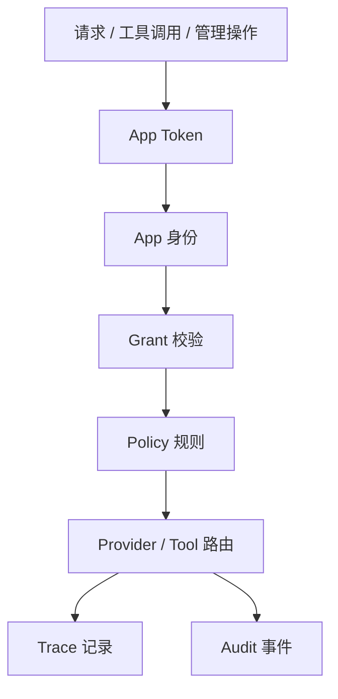

# 权限与审计模型

客户端 AI 网关使用 App Token、Grant、Policy、Trace 和 Audit 组合形成最小可解释权限模型。目标是让“谁调用了什么、为什么允许或拒绝、后续如何排查”能够在本地闭环。

## 权限分层

## Grant 类型

| Grant | 能力 | 典型使用者 |
| --- | --- | --- |
| `chat` | 调用 OpenAI 兼容聊天接口 | 普通桌面应用、IDE Agent |
| `admin` | 访问管理 API，例如 Audit、配置重载、Provider 启停 | 本机管理员工具 |
| `tool` | 调用所有已允许的只读工具 | 受信任 Agent |
| `tool:<scope>` | 调用包含指定 scope 的工具 | 最小权限工具集 |

工具调用会优先匹配宽权限 `tool`，否则要求工具 Manifest 中所有 scope 都有对应的 `tool:<scope>` Grant。

## Policy 规则

Policy 在路由前执行，用于约束模型和 Provider 选择。当前支持：

- `allow`：允许请求，并允许本地或云端 Provider。
- `deny`：路由前拒绝。
- `force_local`：允许请求，但禁止云端 Provider。
- `deny_cloud_for_sensitive`：兼容性效果，用于敏感数据禁止云端降级。

规则可按 `app_ids`、`request_types`、`models`、`provider_classes`、`data_labels` 匹配。空字段表示匹配全部。

## Trace 与 Audit 的分工

| 类型 | 记录什么 | 面向问题 |
| --- | --- | --- |
| Trace | 一次请求或工具调用的链路、Provider、策略、降级、错误、请求安全快照 | “这次调用发生了什么？” |
| Audit | 权限试算、工具调用、管理操作、策略试算、路由解释等事件 | “谁做了什么，为什么允许/拒绝？” |

Trace 不保存 App Token。请求快照会按 `trace_redact_labels` 和 `trace_snapshot_max_chars` 做脱敏或截断。

## 审计字段

重点字段：

- `trace_id`：串联 Trace 和 Audit。
- `app_id`：调用方身份。
- `action`：例如 `tool.invoke`、`policy.dry_run`、`routing.explain`、`provider.enabled`。
- Provider 启停操作会在 metadata 中记录 `old_enabled` 和新的 `enabled`，便于回溯管理变更前后状态。
- `result`：`success`、`denied`、`failed`。
- `target`：工具、Provider、Policy 或其他对象 ID。
- `metadata`：结构化解释信息。

工具调用和权限试算的 `metadata` 会包含：

- `required_scopes`
- `matched_grant`
- `missing_grants`
- `sandbox_required`
- `origin`
- `explain_chain`

## 排查路径

1. 从控制台运行问题汇总进入异常对象。
2. 打开 Trace 查看请求、Provider、Policy、Fallback。
3. 用 `trace_id` 联动审计事件。
4. 查看 Audit metadata 中的 `matched_grant`、`missing_grants`、`explain_chain`。
5. 必要时用 Access dry-run 或 Policy dry-run 复算。

## 安全边界

- 管理接口要求 `admin` Grant。
- App/Grant 目录只返回 `token_hint`，不返回完整 token。
- Audit 导出需要管理员授权。
- MCP Manifest 当前不可执行。
- 只读工具之外的工具会被拒绝。
- 缺少工具 scope 时返回稳定拒绝结果，并写入 Audit。
