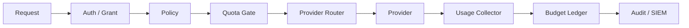

# 配额、预算与速率限制设计草案

本文定义客户端 AI 网关实现用户级配额、Provider 预算和速率限制时需要遵守的边界。当前版本已实现 App 级 `requests_per_minute` 请求前限流；Provider 预算、token/day 记账和成本统计仍处于设计阶段。

## 目标

要解决的问题：

- 防止单个 App、模型或工具占满本机资源。
- 控制云端 Provider 成本和企业预算。
- 在 Provider 失败降级时避免意外切到高成本云端。
- 给控制台、Audit 和 SIEM 提供可解释的拒绝原因。

不做的事：

- 不在当前阶段估算不可得的真实费用。
- 不伪造 Provider usage。
- 不把预算状态作为绕过安全策略的理由。
- 不因为本地额度耗尽自动降级到云端，除非 Policy 明确允许。

## 推荐组件



| 组件 | 责任 |
| --- | --- |
| Quota Gate | 请求前检查 app、model、provider、tool 的额度和速率。 |
| Rate Limiter | 滑动窗口或 token bucket，处理 QPS / RPM / TPM。 |
| Budget Ledger | 请求后按 usage 记账，维护日/月预算。 |
| Usage Collector | 从 Provider Result 读取 token usage，不可得时标记 unknown。 |
| Audit Writer | 记录允许、拒绝、超额、记账和降级决策。 |

## 当前已实现

当前支持 App 级 RPM：

```json
{
  "quotas": {
    "apps": [
      {
        "app_id": "dev-app",
        "requests_per_minute": 120
      }
    ]
  }
}
```

约定：

- `app_id` 必须引用已配置 App。
- `requests_per_minute=0` 或不配置表示不启用该 App 限流。
- 负数会被配置校验拒绝。
- 同一个 App 不能重复配置 quota。
- 命中限流时返回 `rate_limited`，HTTP 状态码为 429。
- Trace 会写入 `quota_rejected` 事件，且不会进入 Provider 路由。
- 运行时健康接口会通过 `quota_runtime` 返回 App quota 数量、启用 RPM 的 App 数量、总 RPM 上限和当前模式；该视图不暴露 App Token。
- 应用列表接口和控制台“应用与授权”面板会展示 App quota 摘要，仅包含是否启用和 `requests_per_minute`。
- 应用列表支持 `quota_enabled=true|false` 筛选，便于快速找出未配置 RPM 限流的 App。

## 后续配置草案

后续可继续增加：

```json
{
  "quotas": {
    "apps": [
      {
        "app_id": "dev-app",
        "requests_per_minute": 60,
        "tokens_per_day": 200000,
        "cloud_tokens_per_day": 20000
      }
    ],
    "providers": [
      {
        "provider_id": "cloud-openai",
        "requests_per_minute": 120,
        "tokens_per_day": 1000000,
        "budget_cents_per_month": 50000
      }
    ],
    "tools": [
      {
        "scope": "desktop.read",
        "requests_per_minute": 30
      }
    ]
  }
}
```

除 `requests_per_minute` 外，其他字段不应新增到正式配置中，除非同步完成校验、控制台展示和测试。

## 决策顺序

聊天请求建议顺序：

1. App Token 校验。
2. `chat` grant 校验。
3. Policy 评估。
4. 请求前 quota/rate 检查。
5. Router 生成符合策略的 Provider 候选。
6. Provider 调用。
7. 请求后 usage 记账。
8. Trace/Audit 写入配额和预算结果。

工具调用建议在 scope 校验后执行 quota/rate 检查。

## Usage 约定

Provider adapter 已返回：

- `prompt_tokens`
- `completion_tokens`
- `total_tokens`

约定：

- Provider 未返回 usage 时保持 0，并将 `usage_source=unknown`。
- 成本计算只能基于明确配置的价格表或企业目录。
- 本地模型可以只记录 token，不计算费用。
- 云端模型必须显式声明价格或标记 `cost_unknown`。
- Trace/Audit 不保存完整 Prompt 来重新估算 token。

## 拒绝与降级

| 场景 | 行为 |
| --- | --- |
| App RPM 超限 | 请求前拒绝，返回 `rate_limited`。 |
| App 日 token 超限 | 请求前拒绝。 |
| Provider RPM 超限 | Router 跳过该 Provider，记录 skip reason。 |
| 云端预算超限 | 跳过云端 Provider，不自动绕过 `deny_cloud_for_sensitive`。 |
| 本地额度超限且云端允许 | 只有 Policy 允许云端时才可尝试云端。 |
| usage 不可得 | 允许请求完成，但 Audit 标记 `usage_source=unknown`。 |

建议新增错误码：

| Code | 说明 |
| --- | --- |
| `quota_exceeded` | App、Provider 或 Tool 非 RPM 配额耗尽，待实现。 |
| `rate_limited` | 网关本地 RPM 限流命中，已用于 App 级请求限流。 |
| `budget_exceeded` | Provider 或组织预算耗尽。 |

## Audit 字段

建议 metadata：

| 字段 | 说明 |
| --- | --- |
| `quota_subject` | `app`、`provider`、`tool`、`tenant`。 |
| `quota_id` | App ID、Provider ID 或 scope。 |
| `quota_window` | `minute`、`day`、`month`。 |
| `quota_limit` | 配额上限。 |
| `quota_used` | 已使用量。 |
| `quota_remaining` | 剩余额度。 |
| `usage_source` | `provider`、`estimated`、`unknown`。 |
| `prompt_tokens` | 输入 token。 |
| `completion_tokens` | 输出 token。 |
| `total_tokens` | 总 token。 |
| `cost_cents` | 成本，未知时不写。 |

## 控制台需求

后续控制台应提供：

- App 配额视图。
- Provider 预算视图。
- 最近超限事件。
- 按 app/provider/model 聚合的 token 使用趋势。
- 云端预算临近耗尽提示。
- 导出到 JSONL 或企业审计管道。

## 验收门槛

实现前至少需要：

- Config 校验：负数、未知 app/provider/scope、重复规则。
- Rate limiter 单元测试：窗口重置、并发请求、边界值。
- Pipeline 测试：请求前拒绝、Provider 跳过、usage 记账。
- Access 测试：错误码、Trace ID、Audit metadata。
- Router 测试：预算超限 Provider 不进入候选。
- UI smoke：配额面板存在，超限事件可查询。

## 当前决策

当前版本保持：

- 只做 App 级 `requests_per_minute` 限流。
- 不做真实预算扣减。
- 不新增 Provider 预算、token/day 或成本字段。
- 不改变 Provider fallback 顺序。
- Usage 只随 OpenAI-compatible 响应返回给调用方。
